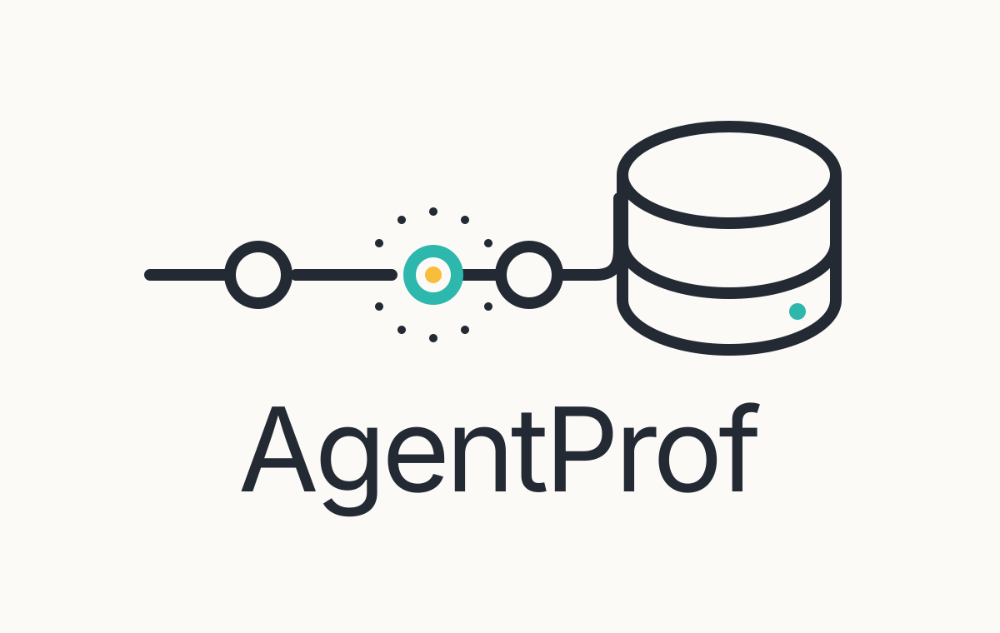
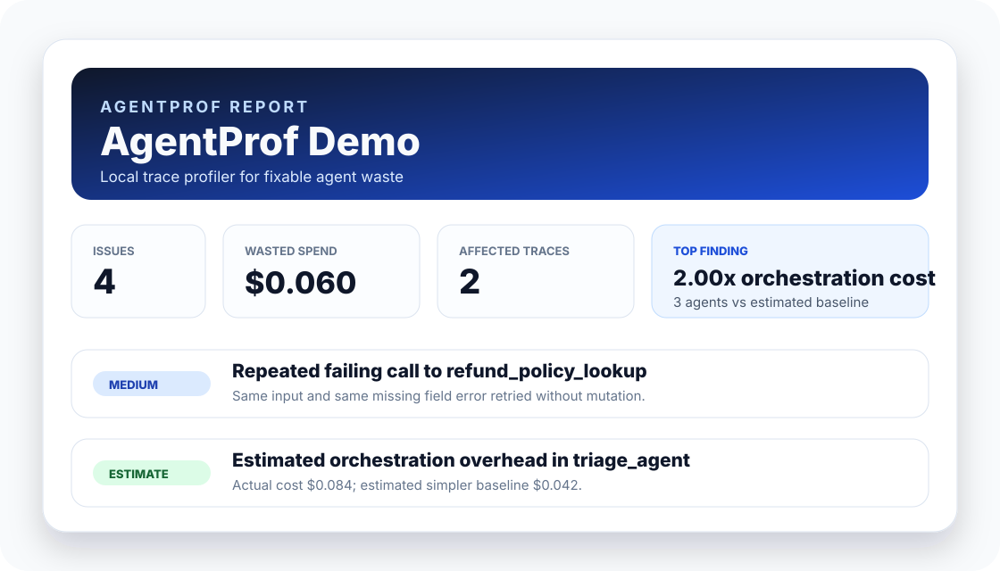
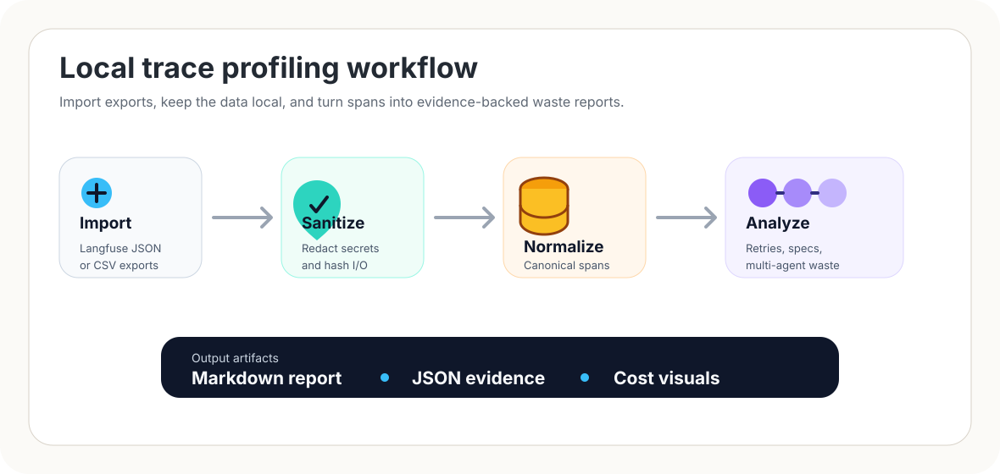
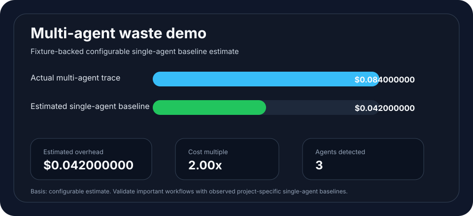

<p align="center">
  
</p>

# AgentProf

[](https://github.com/tjdonley/AgentProf/actions/workflows/test.yml)
[](LICENSE)

Find hidden waste in your AI-agent traces.

AgentProf answers the next question after your trace viewer shows what happened: what did this agent waste, why did it happen, and what should you fix first?

It turns Langfuse exports and other trace data into evidence-backed reports on retry loops, contract failures, and wasted orchestration cost. It runs on your machine, stores data in DuckDB, and writes static reports you can inspect or share internally.

The bundled demo shows the problem before you connect real data: one trace spends 50% of its cost on multi-agent orchestration overhead, and another repeats the same broken `refund_policy_lookup` call with the same missing `region` field.

Use AgentProf when you need to:

- debug Langfuse traces from exported observations without sending trace data to another service.
- detect agent retry loops where the same failing call repeats with the same input and error signature.
- run an LLM agent cost profiler that attributes spend to retries, contract failures, and multi-agent overhead.
- add local agent observability through static Markdown, JSON, HTML, and SVG reports.

<p align="center">
  
</p>

## Demo In One Command

Expected story:

```text
AgentProf found 4 issue(s) and $0.060000000 of estimated wasted spend.
Top finding: multi-agent trace trace-multi-agent-1 cost 2.00x an estimated single-agent baseline across 3 agents.
```

From a checkout:

```bash
uv sync
uv run agentprof demo --open
```

After the first package release:

```bash
uvx agentprof demo --open
```

The bundled demo imports sample Langfuse traces, runs all current analyzers, and writes a self-contained report under `agentprof-demo/reports/`.

Want to inspect the output before running anything? See the checked-in [demo HTML report](examples/reports/demo.html), [Markdown report](examples/reports/demo.md), and [JSON payload](examples/reports/demo.json).

## Waste Patterns It Flags

| Symptom in the trace | What AgentProf reports | Why it matters |
| --- | --- | --- |
| Two identical failed `refund_policy_lookup` calls | `retry_loop` with 1 wasted retry attempt and $0.006000000 of retry waste | Stop retrying deterministic tool failures until the input changes. |
| Tool input is missing `region` | Two `spec_violation` findings with affected span IDs and redacted evidence | Catch broken tool contracts before the agent keeps spending. |
| A three-agent triage path costs $0.084000000 | `multi_agent_waste` estimates $0.042000000 overhead against a $0.042000000 single-agent baseline | Compare orchestration against a simpler path before keeping it. |

See [Debug Langfuse traces with AgentProf](docs/debug-langfuse-traces.md) for the concrete report snippets and before/after framing.

## What AgentProf Finds

- Repeated failed calls where the same input fails with the same error signature.
- Tool/spec contract violations such as missing required input fields.
- Multi-agent orchestration overhead compared with a configured or observed single-agent baseline.
- Cost ledger entries that separate successful, failed, unknown, and analyzer-attributed waste.
- Evidence-backed recommendations with affected trace/span IDs and redacted previews.

## Searchable Use Cases

- Debug Langfuse traces after an agent run looks expensive or hard to explain.
- Detect agent retry loops caused by deterministic tool, schema, or precondition failures.
- Use a local LLM agent cost profiler before adding another hosted observability surface.
- Run local agent observability reports for audits, postmortems, and teammate handoffs.

## Why Local-First

- No outbound telemetry is sent by AgentProf.
- Raw input/output is not persisted by default.
- Common secrets and PII are redacted before payloads are stored.
- Input/output values can be compared by stable HMAC hashes without exposing raw content.
- Reports are static Markdown, JSON, HTML, and SVG files.

## What AgentProf Is Not

- Not a hosted observability dashboard.
- Not a trace collection server.
- Not prompt management.
- Not a replacement for Langfuse, Phoenix, or LangSmith.
- Not an eval framework.

AgentProf complements tracing tools by profiling exported traces locally and turning them into fixable waste reports.

## How It Works

<p align="center">
  
</p>

| Stage | What AgentProf Does |
| --- | --- |
| Import | Loads Langfuse observation exports from JSON or CSV. |
| Privacy | Redacts common secrets and hashes input/output values when configured. |
| Normalize | Maps provider payloads into canonical spans and traces in local DuckDB. |
| Analyze | Detects retry loops, configured spec violations, and multi-agent orchestration overhead. |
| Report | Writes Markdown, JSON, HTML, and multi-agent waste SVG artifacts. |

## What Works Today

- Initialize a local AgentProf workspace with `agentprof init`.
- Import Langfuse observations from JSON or CSV exports.
- Redact common secrets and PII before raw payloads are persisted.
- Hash input/output values with HMAC-SHA256 when configured.
- Store raw and normalized trace data in a local DuckDB database.
- Normalize Langfuse observations into canonical span and trace tables.
- Show data-quality coverage for parent links, status, costs, tokens, models, and I/O hashes.
- Build an idempotent cost ledger from normalized span costs.
- Print a status-based cost waterfall for successful, failed, and unknown span costs.
- Detect retry loops where the same failing call repeats with the same input fingerprint and error signature.
- Detect configured tool/spec contract violations from normalized redacted previews and error messages.
- Estimate multi-agent orchestration overhead against configured or observed single-agent baselines.
- Generate local Markdown, JSON, and static HTML reports from persisted issues, evidence, costs, and optional visuals.
- List and show generated reports from the local store.

## Current Status

AgentProf is early MVP software, but the core local workflow is usable today for Langfuse export import, normalization, analysis, cost attribution, and report generation.

Planned next:

- Additional deterministic failure/waste analyzers.
- Generic JSONL, OpenInference/OpenTelemetry, Phoenix, and direct API ingestion.
- Baseline/diff workflows and CI budget gates.

## Requirements

- Python 3.11 or newer.
- [`uv`](https://docs.astral.sh/uv/) for dependency management and command execution.

## Debug Langfuse Traces From Your Own Export

After running the bundled demo, initialize a workspace and run your own Langfuse observation export through the end-to-end workflow:

```bash
uv sync
uv run agentprof init
export AGENTPROF_HASH_SALT='dev-salt-value-at-least-16-bytes'
uv run agentprof doctor
uv run agentprof import langfuse-export \
  --observations tests/fixtures/langfuse_observations.json
uv run agentprof normalize
uv run agentprof analyze retry-loops
uv run agentprof analyze spec-violations
uv run agentprof analyze multi-agent-waste
uv run agentprof cost ledger
uv run agentprof report generate --report-id latest
uv run agentprof report list
uv run agentprof store stats
```

The default fixture focuses on retry/spec behavior and does not include cost fields, so `agentprof cost ledger` will produce zero ledger entries for that sample. Use `tests/fixtures/langfuse_multi_agent_observations.json` for a costed multi-agent waste demo.

The workflow creates local files only. After `agentprof report generate`, the default report artifacts are written under `.agentprof/reports/` and can be inspected with `agentprof report show`.

## Typical Workflow

1. Initialize the workspace.

```bash
uv run agentprof init
```

This creates `agentprof.yml`, local workspace directories under `.agentprof/`, `.agentprof/.gitignore`, and the DuckDB store at `.agentprof/data/agentprof.duckdb`.

2. Configure privacy.

By default, `agentprof.yml` sets `privacy.hash_inputs: true`, so imports that contain input/output values require a salt in the environment variable named by `privacy.hmac_salt_env`.

```bash
export AGENTPROF_HASH_SALT='replace-with-a-stable-secret-for-this-project'
```

Use a stable per-project salt of at least 16 bytes if you want hashes to remain comparable across repeated imports. Do not commit the salt.

3. Import a Langfuse observations export.

```bash
uv run agentprof import langfuse-export --observations path/to/observations.json
```

CSV exports are supported by file extension or explicit format:

```bash
uv run agentprof import langfuse-export \
  --observations path/to/observations.csv \
  --format csv
```

4. Normalize imported spans.

```bash
uv run agentprof normalize
```

This maps provider-specific observation payloads into canonical `normalized_spans` and `normalized_traces` tables.

5. Detect agent retry loops.

```bash
uv run agentprof analyze retry-loops
```

This writes `retry_loop` issues, issue evidence, and wasted retry costs when repeated failed attempts have the same trace, parent span, name, input retry fingerprint, and error signature.

6. Detect configured spec violations.

```bash
uv run agentprof analyze spec-violations
```

This writes `spec_violation` issues, issue evidence, and wasted spec-violation costs when spans violate required input or output fields configured in `agentprof.yml`.

7. Estimate multi-agent orchestration overhead.

```bash
uv run agentprof analyze multi-agent-waste
```

This writes `multi_agent_waste` issues, issue evidence, and estimated orchestration overhead costs when a costed trace has multiple distinct root/agent actors. The default estimate uses a configured single-agent baseline ratio, which defaults to `0.50` and can be changed with `--baseline-ratio`. Use `--baseline-mode observed` when the store also contains matching successful single-agent traces.

8. Build the cost ledger.

```bash
uv run agentprof cost ledger
```

This replaces the current normalized-span cost ledger entries idempotently and prints a waterfall grouped by span status.

9. Generate a local report.

```bash
uv run agentprof report generate
```

This writes Markdown, JSON, and HTML report files under `.agentprof/reports/` and stores report metadata in the `reports` table.

10. List or inspect generated reports.

```bash
uv run agentprof report list
uv run agentprof report show latest
uv run agentprof report show latest --format json
```

Use a stable `--report-id` when generating reports if you want a predictable ID such as `latest`.

11. Inspect store row counts.

```bash
uv run agentprof store stats
```

## Multi-Agent Waste Demo

The costed multi-agent fixture shows a delayed-order refund question that fans out from `triage_agent` to `research_agent` and `policy_agent`, then compares that orchestration shape with a configured single-agent baseline:

```bash
uv run agentprof store reset --yes
AGENTPROF_HASH_SALT=dev-salt-value-at-least-16-bytes uv run agentprof import langfuse-export \
  --observations tests/fixtures/langfuse_multi_agent_observations.json
uv run agentprof normalize
uv run agentprof analyze multi-agent-waste --baseline-ratio 0.50
uv run agentprof report generate --report-id multi-agent-demo
```

<p align="center">
  
</p>

Expected analyzer story for that fixture:

| Metric | Value |
| --- | ---: |
| Actual multi-agent trace cost | $0.084000000 |
| Estimated single-agent baseline | $0.042000000 |
| Estimated orchestration overhead | $0.042000000 |
| Cost multiple | 2.00x |
| Agents detected | 3 |

The report command writes predictable local artifacts when `--report-id multi-agent-demo` is used:

```text
.agentprof/reports/
  multi-agent-demo.md
  multi-agent-demo.json
  multi-agent-demo.html
  multi-agent-demo-multi-agent-waste.svg
```

This is a configurable estimate, not an observed project-specific baseline. Treat it as a research-prior starting point and validate important workflows with project-specific single-agent baseline traces when available.

For project-specific comparisons, run the analyzer in observed mode after importing comparable successful single-agent traces:

```bash
uv run agentprof analyze multi-agent-waste \
  --baseline-mode observed \
  --min-baseline-matches 1
```

Observed mode matches costed successful single-agent traces by normalized root task name and, when available, root input hash. It uses the median matched single-agent trace cost as the baseline and records matched baseline trace IDs in issue evidence.

## CLI Commands

| Command | Purpose |
| --- | --- |
| `agentprof --help` | Show top-level CLI help. |
| `agentprof demo` | Run the full pipeline on bundled sample traces and write a local demo report. |
| `agentprof init` | Create `agentprof.yml`, workspace directories, and the DuckDB schema. |
| `agentprof doctor` | Validate that the local workspace and store are usable. |
| `agentprof import langfuse-export` | Import Langfuse observation exports into `raw_spans`. |
| `agentprof normalize` | Normalize raw imported spans into canonical trace/span tables. |
| `agentprof analyze retry-loops` | Detect repeated failing calls with the same retry fingerprint. |
| `agentprof analyze spec-violations` | Detect spans that violate configured required field contracts. |
| `agentprof analyze multi-agent-waste` | Estimate multi-agent orchestration overhead against configured or observed single-agent baselines. |
| `agentprof cost ledger` | Build `cost_ledger` from normalized span costs and print a waterfall. |
| `agentprof report generate` | Generate Markdown, JSON, and HTML reports from persisted analysis results. |
| `agentprof report list` | List generated reports recorded in the local store. |
| `agentprof report show REPORT_ID` | Print a generated report's Markdown, JSON, or HTML artifact. |
| `agentprof store stats` | Show row counts for all store tables. |
| `agentprof store reset --yes` | Delete and recreate the local DuckDB store. |

## Spec Contracts

Spec-violation analysis is opt-in. Add contracts under `analyzers.spec_violations.contracts`:

```yaml
analyzers:
  spec_violations:
    contracts:
      - name: refund_policy_lookup
        required_input_fields:
          - customer_id
          - region
        required_output_fields:
          - answer
          - confidence
```

By default, a contract matches spans whose normalized `name` equals the contract `name`. Use `span_name` when you want a stable contract name that differs from the observed span name.

## Input Data

The current importer expects a Langfuse observations export in one of these shapes:

- A JSON array of observation objects.
- A JSON object with a `data` array.
- A JSON object with an `observations` array.
- A CSV file readable as observation rows.

Observation IDs, trace IDs, parent observation IDs, timestamps, status fields, model/provider fields, token usage, cost details, metadata, and sanitized privacy metadata are used during normalization where available.

## Privacy Model

AgentProf is designed to be local-first and privacy-conscious by default.

- No outbound telemetry is sent by AgentProf.
- Data is stored locally in DuckDB under `.agentprof/` unless `store.path` is changed.
- Raw input/output fields are not persisted by default.
- Common sensitive values are redacted before payload persistence.
- Supported redactions include emails, phone numbers, API keys/secrets, credit cards, JWTs, URLs with query strings, and sensitive mapping keys such as `authorization` and `api_key`.
- Input/output hashes use HMAC-SHA256 with your configured salt environment variable.
- Redacted evidence previews are capped by `privacy.max_evidence_chars`.

The default privacy config generated by `agentprof init` is:

```yaml
privacy:
  store_raw_io: false
  store_redacted_io: true
  hash_inputs: true
  hmac_salt_env: AGENTPROF_HASH_SALT
  max_evidence_chars: 500
```

## Reports

Generate reports after running analyzers and cost attribution:

```bash
uv run agentprof report generate
```

Use `--report-id` for a stable filename, or `--output-dir` to write files somewhere other than `.agentprof/reports/`:

```bash
uv run agentprof report generate \
  --report-id latest \
  --output-dir .agentprof/reports
```

Report JSON contains a machine-readable summary, issue details with evidence, and cost ledger entries. Report Markdown and static HTML contain the same information in local-first shareable formats:

```text
# AgentProf Report: AgentProf

## Summary
| Metric | Value |
| --- | ---: |
| Issues | 1 |
| Total wasted cost | $0.042000000 |

## Visuals

```

When persisted `multi_agent_waste` issues exist, `agentprof report generate` also writes `<report-id>-multi-agent-waste.svg` next to the Markdown/JSON/HTML files, embeds or links it from the Markdown and HTML reports, and records the artifact filename in `summary.artifacts.multi_agent_waste_svg`.

List and inspect generated reports:

```bash
uv run agentprof report list
uv run agentprof report show latest
uv run agentprof report show latest --format json
uv run agentprof report show latest --format html
```

## Local Store

The DuckDB store currently includes these tables:

- `raw_spans`
- `raw_traces`
- `normalized_spans`
- `normalized_traces`
- `issues`
- `issue_evidence`
- `cost_ledger`
- `reports`

The `reports` table stores generated report metadata and points to the local Markdown/JSON/HTML output files.

## Development

Useful project docs:

- [Contributing](CONTRIBUTING.md)
- [Security policy](SECURITY.md)
- [Changelog](CHANGELOG.md)
- [Project pop spec](docs/project-pop-spec.md)

Install dependencies and run tests:

```bash
uv sync
uv run pytest
```

Build package artifacts:

```bash
uv build
```

Useful local smoke workflow:

```bash
uv run agentprof store reset --yes
AGENTPROF_HASH_SALT=dev-salt-value-at-least-16-bytes uv run agentprof import langfuse-export \
  --observations tests/fixtures/langfuse_observations.json
uv run agentprof normalize
uv run agentprof analyze retry-loops
uv run agentprof analyze spec-violations
uv run agentprof analyze multi-agent-waste
uv run agentprof cost ledger
uv run agentprof report generate
uv run agentprof report list
uv run agentprof store stats
```
