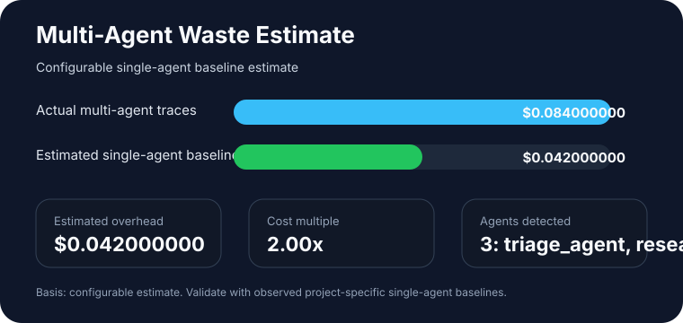

# AgentProf Report: AgentProf Demo

Report ID: `demo`
Generated at: `2026-05-30T14:11:08.868496Z`

## Summary

| Metric | Value |
| --- | ---: |
| Issues | 4 |
| Evidence items | 5 |
| Affected traces | 2 |
| Affected spans | 3 |
| Total wasted cost | $0.060000000 |
| Potential savings | $0.060000000 |

## Visuals

## Issues

### Estimated orchestration overhead in triage_agent

- Issue ID: `multi_agent_waste:a7887662c9f550c6`
- Kind: `multi_agent_waste`
- Severity: `medium`
- Confidence: `medium`
- Affected traces: 1
- Affected spans: 5
- Wasted cost: $0.042000000
- Potential savings: $0.042000000

Recommendation: Compare this multi-agent trace with a configured single-agent baseline before keeping the orchestration path.

Recommended tests:

- Add an eval that compares the multi-agent trace against the configured single-agent baseline.

Evidence:

- `trace-multi-agent-1:ma-root-1` Trace used 3 distinct agents; estimated orchestration overhead uses a configured single-agent baseline ratio.

### Repeated failing call to refund_policy_lookup

- Issue ID: `retry_loop:14f469d943d86373`
- Kind: `retry_loop`
- Severity: `medium`
- Confidence: `high`
- Affected traces: 1
- Affected spans: 2
- Wasted cost: $0.006000000
- Potential savings: $0.006000000

Recommendation: Stop retrying deterministic failures until the input, schema, or tool precondition has changed.

Recommended tests:

- Add a regression test that identical failing tool input is not retried without mutation.

Evidence:

- `trace-demo-retry:demo-tool-retry-1` Attempt 1 failed with missing required field region.
- `trace-demo-retry:demo-tool-retry-2` Attempt 2 failed with missing required field region.

### Contract violation in refund_policy_lookup

- Issue ID: `spec_violation:ae3bd3cc2b213fc6`
- Kind: `spec_violation`
- Severity: `medium`
- Confidence: `high`
- Affected traces: 1
- Affected spans: 1
- Wasted cost: $0.006000000
- Potential savings: $0.006000000

Recommendation: Validate tool inputs and outputs against the configured contract before continuing the agent trace.

Recommended tests:

- Add a contract test for refund_policy_lookup covering required fields.

Evidence:

- `trace-demo-retry:demo-tool-retry-2` refund_policy_lookup violated refund_policy_lookup: missing input fields: region.

### Contract violation in refund_policy_lookup

- Issue ID: `spec_violation:d62c2c3a59097026`
- Kind: `spec_violation`
- Severity: `medium`
- Confidence: `high`
- Affected traces: 1
- Affected spans: 1
- Wasted cost: $0.006000000
- Potential savings: $0.006000000

Recommendation: Validate tool inputs and outputs against the configured contract before continuing the agent trace.

Recommended tests:

- Add a contract test for refund_policy_lookup covering required fields.

Evidence:

- `trace-demo-retry:demo-tool-retry-1` refund_policy_lookup violated refund_policy_lookup: missing input fields: region.

## Cost Ledger

| Cost type | Amount | Attribution | Issue |
| --- | ---: | --- | --- |
| failed_span_cost | $0.006000000 | normalized_span_status |  |
| wasted_spec_violation_cost | $0.006000000 | spec_violation | spec_violation:d62c2c3a59097026 |
| failed_span_cost | $0.006000000 | normalized_span_status |  |
| wasted_retry_cost | $0.006000000 | retry_loop | retry_loop:14f469d943d86373 |
| wasted_spec_violation_cost | $0.006000000 | spec_violation | spec_violation:ae3bd3cc2b213fc6 |
| successful_span_cost | $0.052000000 | normalized_span_status |  |
| successful_span_cost | $0.032000000 | normalized_span_status |  |
| estimated_multi_agent_overhead | $0.042000000 | multi_agent_waste | multi_agent_waste:a7887662c9f550c6 |

